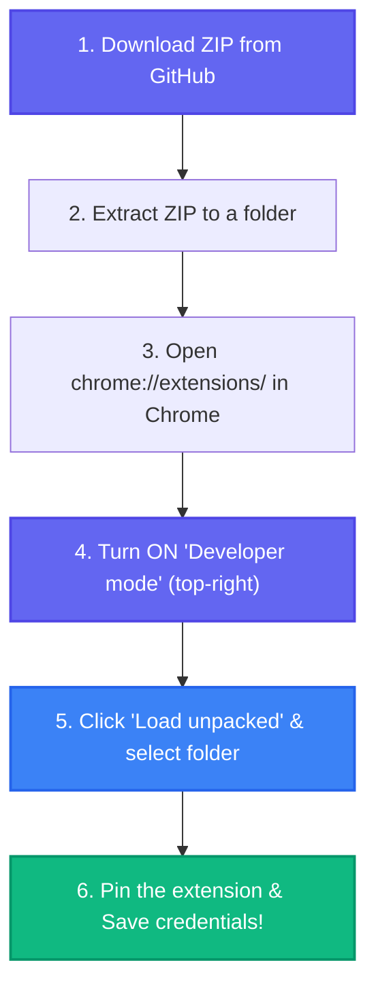
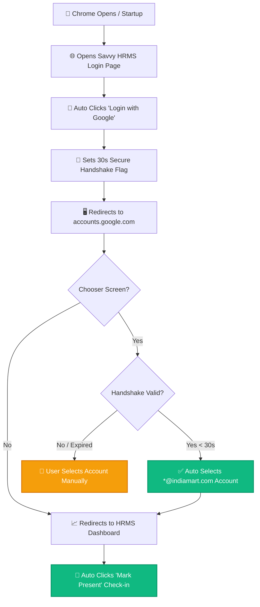

# HRMS Auto Login Chrome Extension

A Manifest V3 Google Chrome Extension designed to automate the authentication and check-in procedures for the Savvy HRMS portal.

---

## 🛠️ Step-by-Step Installation

---

## 🔄 How the Automation Works

The extension works automatically while keeping your Google Sign-in on other websites completely secure using a 30-second handshake protocol:

