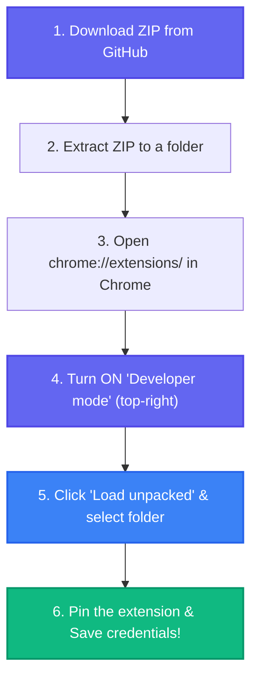

# HRMS Auto Login Chrome Extension

A Manifest V3 Google Chrome Extension designed to automate the authentication and check-in procedures for the Savvy HRMS portal.

---

## 🎥 Video Demonstration

*(Click the image above to watch the full video demonstration on Google Drive)*

---

## 🛠️ Step-by-Step Installation

---

## 🔄 How the Automation Works

The extension works automatically while securely managing your sign-in process. Here is the step-by-step flow:

1. **Smart Startup Check**: When Chrome opens, the extension checks your configured Work From Home (WFH) days. If today is a WFH day, it proceeds to open the Savvy HRMS login page. If not, it stays silent.
2. **Auto Login Attempt**: Once the HRMS portal loads, the extension attempts to click the "Login with Google" button.
3. **Secure Handshake Protocol**: A 30-second secure handshake flag is set before redirecting to `accounts.google.com`. This ensures it only auto-selects your work email if the login was initiated by the extension.
4. **Google Account Selection**: If the handshake is valid (within 30 seconds) and you are presented with the account chooser, it automatically selects your work email account.
5. **Fallback Mechanism**: If the Google login fails or times out, the extension will fall back to using your configured Username and Password (if provided in the settings).
6. **Automatic Check-in**: After successfully landing on the HRMS Dashboard, the extension automatically finds and clicks the "Mark Present" button.
